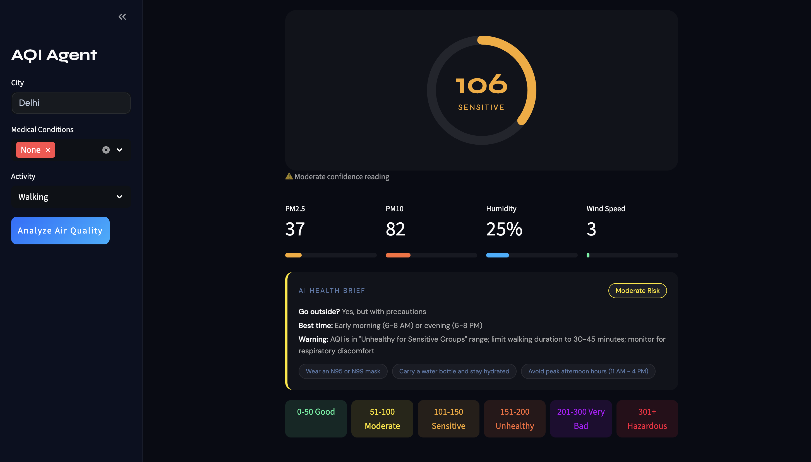

# AQI Analysis Agent

A personalized air quality monitoring app that turns live air data into clear, practical health guidance.

Live app: https://aqi-analyzer-agent.streamlit.app/

## 🖼️ Screenshot


## ✨ Features
- Real time AQI data with weather context
- EPA formula for accurate AQI calculation
- AI powered health recommendations
- Personalized advice based on medical conditions
- Dark cyberpunk UI built with Streamlit
- City validation and error handling

## 🧰 Tech Stack
- Python
- Streamlit (UI)
- Weather API (AQI + weather data)
- AI model API (recommendations)
- AQI data API (cross check accuracy)

## ⚙️ Setup
1. Clone the repo
2. Install dependencies:
   ```bash
   pip install -r requirements.txt
   ```
3. Create a .env file with these keys:
   ```bash
   WEATHER_API_KEY=your-key
   AI_API_KEY=your-key
   AQI_API_KEY=your-key
   ```
4. Run:
   ```bash
   streamlit run main.py
   ```

## 🔑 How to Get API Keys
- Get keys from your preferred weather, AI model, and AQI data providers.

## 🧠 How It Works
- User enters city and health profile
- App fetches live AQI and weather data
- EPA formula calculates accurate AQI
- AI generates personalized health advice
- Results shown in a dark dashboard UI

## 🗂️ Project Structure
aqi-agent/
├── main.py          # Streamlit UI
├── agent.py         # AI health recommendations
├── aqi_fetcher.py   # Fetches live AQI data
├── .env             # API keys (not committed)
└── requirements.txt # Dependencies

Built as a learning project 

## ✍️ Author
Anushka Sharma
